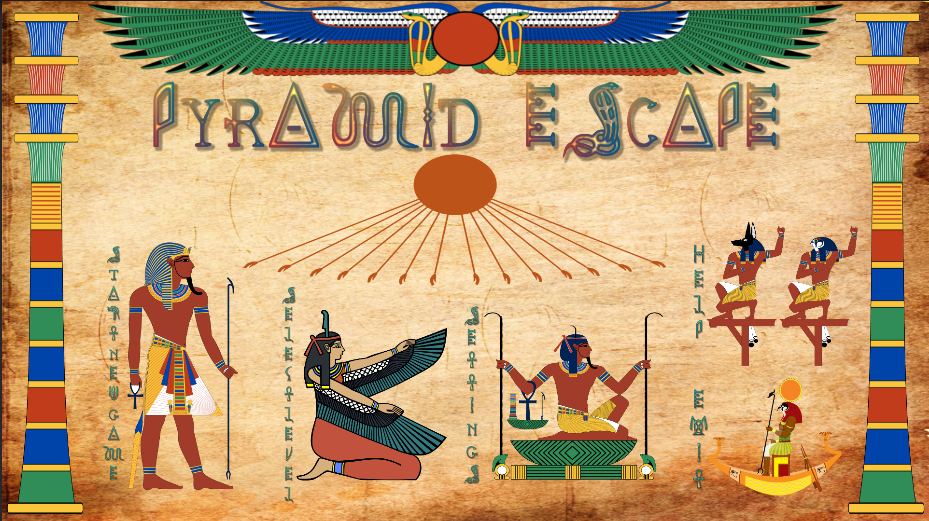
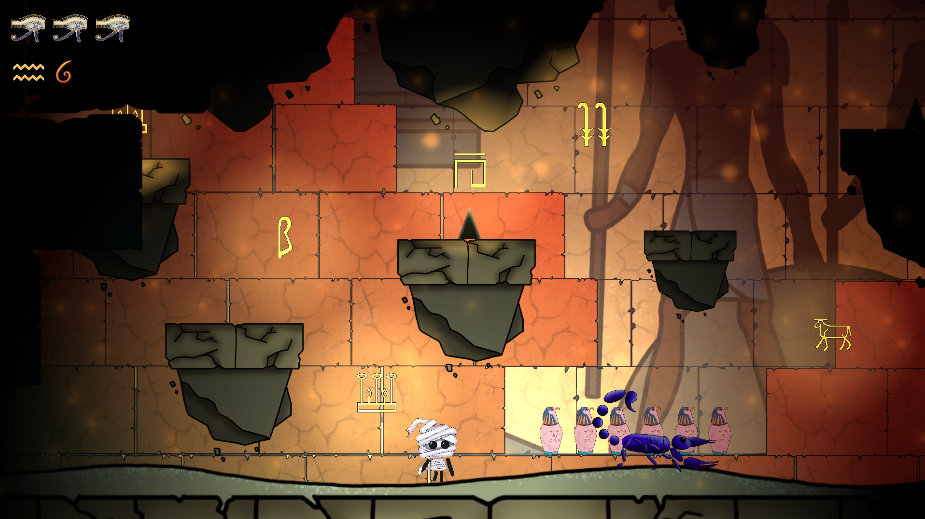
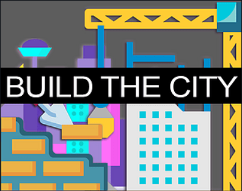
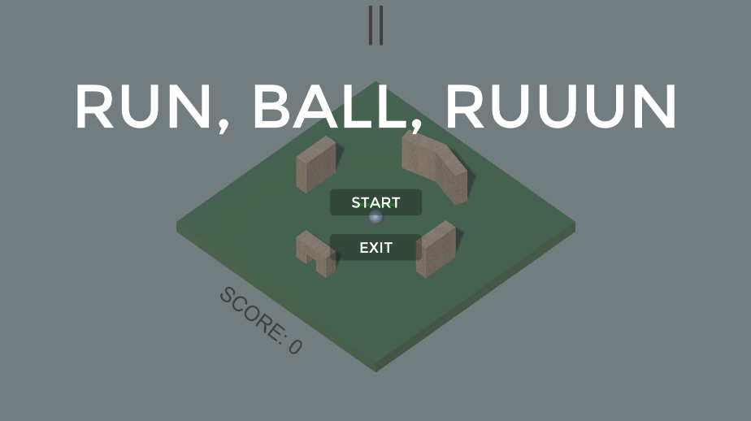
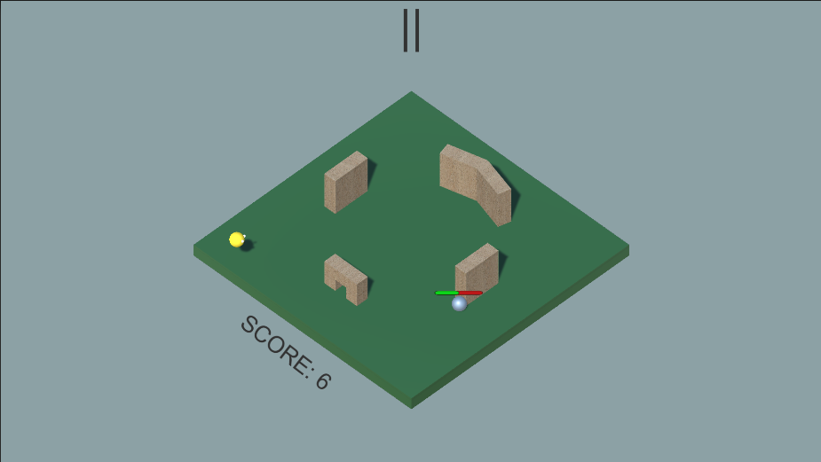
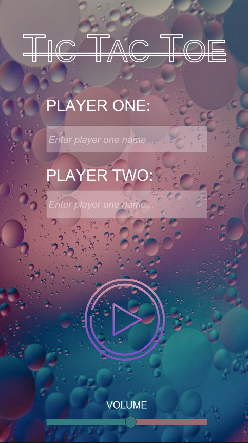
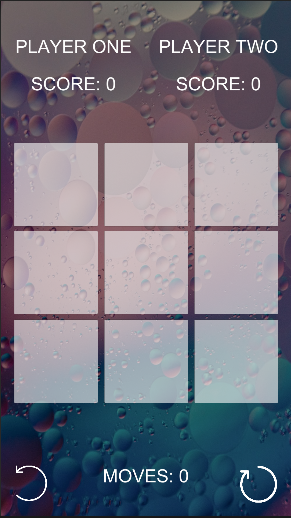

## PORTFOLIO

---

### GAMES 
<b style="font-size: 25px;">[PYRAMID ESCAPE](https://bernarda.itch.io/pyramid-escape)</b>
 

  

  

 
<b> Unity education at PISMO Novska| Final Project </b>
 
<b>Project description:</b> Design and development from scratch a 2D platform game for PC, based of Super Marioand Hollow Knight mechanics and dynamics. Project developed by a team of 2 developers.
 
<b>Gameplay:</b> Pyramid Escape is a fun and easy adventure 2D platform game with educational and historical aspects where little mummy named Milo, who has just woken up from a longsleep, discovers the world of ancient Egypt. Following a comic-like cut scenes playerlearns about Egyptian culture, their gods, afterlife, mummification and so on. Player controls the mummy whose goal is to collect hieroglyphics for player to be able to move to another room what represents completing a level.
 
<b>Project achievement:</b> Finished on time with presented demo with four levels total.
 
<b>Roles:</b> Project lead | Game designer | Lead Programmer | Level desiger | Art designer
 
<b>Technologies used:</b> Unity | Visual Studio | Adobe Photoshop

 
<b style="font-size: 25px;">[R e f l e c t i o n s](https://imt-rexx.itch.io/reflections)</b>
 

  

  

 
<b> Unity education at PISMO Novska| Global Game Jam </b>
 
<b>Project description:</b> Design and development of a game with a given theme "Duality".
 
<b>Gameplay:</b> You play as a detective on a case more intense than usual. Use his sharpened,experienced intuition to focus and locate clues that will help unfurl a plot of a killer on the loose.
 
<b>Project achievement:</b> This game was made in 48h during GGJ2022 held in Novska, Croatia. Project won second place in the competition.
 
<b>Roles:</b> Programmer
 
<b>Technologies used:</b> Unity | Visual Studio | Adobe Photoshop

 
<b style="font-size: 25px;">[Build The City](https://bernarda.itch.io/build-the-city)<b>
 

  

  

 
<b> Unity education at PISMO Novska </b>
 
<b>Project description: Design and development of simple click game for UI design practice</b> 
 
<b>Gameplay:</b> Simple click game where the goal is to raise population as days go by. Beware of random disasters that may happen during gameplay and destory your progess.
 
<b>Project achievement:</b> This project was successfully created in 5 days period.
 
<b>Roles:</b> Programmer | UI designer
 
<b>Technologies used:</b> Unity | Visual Studio | Adobe Photoshop

  
 
<b style="font-size: 25px;"> Run, ball, ruuun<b>
 

    

    

 
<b> Unity education at PISMO Novska </b>
 
<b>Project description:</b> Design and development of simple 3D isometric game 
 
<b>Gameplay:</b> You play as a simple ball with certain amount of health. Your goal is to awoid colorfull ghosts and get them destroyed by hiding behind the obsticles. Beware, after certain amount of points ghosts became faster so it's harder to awoid them. After you lose, you can check the leaderboard and see where you stand in relation to another players.
 
<b>Project achievement:</b> This project was successfully created in one day.
 
<b>Roles:</b> Programmer | UI designer | Level desiger | 3D artist
 
<b>Technologies used:</b> Unity | Visual Studio

 
<b style="font-size: 25px;">Tic-Tac-Toe</b>
 

    

    

 
<b> Unity education at PISMO Novska</b>
 
<b>Project description: Design and development of well-know mobile game Tic-Tac-Toe for pracitice</b> 
 
<b>Gameplay:</b> Challenge your friend in the famous Tic-Tac-Toe game, create a series of your three characters and win.
 
<b>Project achievement:</b> This project was successfully created in 2 days period.
 
<b>Roles:</b> Programmer | UI designer
 
<b>Technologies used:</b> Unity | Visual Studio | Adobe Photoshop

  
---

### LEVEL DESIGN

  <b>[Tag](https://adamas2021.itch.io/tag)</b>
   
  
   
  This game is made for weekly project with theme "Strange Power-Ups" during the Unity education in "PISMO" incubator,  Novska, Croatia.
   
  <b>Task: </b> Level design

  <b>[Look For Luka](https://loki2379.itch.io/look-for-luka)</b>
   
  
   
  This game is made as a project to represent a potential renovation of a certain part of the town 
   
  <b>Task: </b> Level design
  

---
### WALLPAPER

---

Page template forked from <a href="https://github.com/evanca/quick-portfolio">evanca</a>

<!-- Remove above link if you don't want to attibute -->
