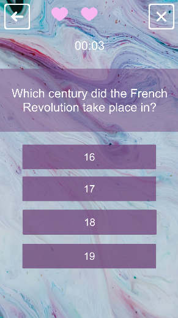

## PORTFOLIO

---

### GAMES 
<b style="font-size: 25px;">[PYRAMID ESCAPE](https://bernarda.itch.io/pyramid-escape)</b>
 

  

  

 
<b> Unity education at PISMO Novska| Final Project </b>
 
<b>Project description:</b> Design and development from scratch a 2D platform game for PC, based of Super Marioand Hollow Knight mechanics and dynamics. Project developed by a team of 2 developers.
 
<b>Gameplay:</b> Pyramid Escape is a fun and easy adventure 2D platform game with educational and historical aspects where little mummy named Milo, who has just woken up from a longsleep, discovers the world of ancient Egypt. Following a comic-like cut scenes playerlearns about Egyptian culture, their gods, afterlife, mummification and so on. Player controls the mummy whose goal is to collect hieroglyphics for player to be able to move to another room what represents completing a level.
 
<b>Project achievement:</b> Finished on time with presented demo with four levels total.
 
<b>Roles:</b> Project lead | Game designer | Lead Programmer | Level desiger | Art designer
 
<b>Technologies used:</b> Unity | Visual Studio | Adobe Photoshop

 
<b style="font-size: 25px;">[R e f l e c t i o n s](https://imt-rexx.itch.io/reflections)</b>
 

  

  

 
<b> Unity education at PISMO Novska| Global Game Jam </b>
 
<b>Project description:</b> Design and development of a game with a given theme "Duality".
 
<b>Gameplay:</b> You play as a detective on a case more intense than usual. Use his sharpened,experienced intuition to focus and locate clues that will help unfurl a plot of a killer on the loose.
 
<b>Project achievement:</b> This game was made in 48h during GGJ2022 held in Novska, Croatia. Project won second place in the competition.
 
<b>Roles:</b> Programmer
 
<b>Technologies used:</b> Unity | Visual Studio | Adobe Photoshop

 
<b style="font-size: 25px;">[Build The City](https://bernarda.itch.io/build-the-city)<b>
 

  

  

 
<b> Unity education at PISMO Novska </b>
 
<b>Project description:</b> Design and development of simple click game for UI design practice. 
 
<b>Gameplay:</b> Simple click game where the goal is to raise population as days go by. Beware of random disasters that may happen during gameplay and destory your progess.
 
<b>Project achievement:</b> This project was successfully created in 5 days period.
 
<b>Roles:</b> Programmer | UI designer
 
<b>Technologies used:</b> Unity | Visual Studio | Adobe Photoshop

  
 
<b style="font-size: 25px;"> Run, ball, ruuun<b>
 

    

    

 
<b> Unity education at PISMO Novska </b>
 
<b>Project description:</b> Design and development of simple 3D isometric game. 
 
<b>Gameplay:</b> You play as a simple ball with certain amount of health. Your goal is to awoid colorfull ghosts and get them destroyed by hiding behind the obsticles. Beware, after certain amount of points ghosts became faster so it's harder to awoid them. After you lose, you can check the leaderboard and see where you stand in relation to another players.
 
<b>Project achievement:</b> This project was successfully created in one day.
 
<b>Roles:</b> Programmer | UI designer | Level desiger | 3D artist
 
<b>Technologies used:</b> Unity | Visual Studio

  
 
<b style="font-size: 25px;">Quiz</b>
 

    

    

 
<b> Unity education at PISMO Novska</b>
 
<b>Project description:</b> Design and development of mobile game quiz based on historical aspects. 
 
<b>Gameplay:</b> Simple quiz game where the goal is to collect as many points in certain amount of time. You have 3 lifes to begin with, every wrong answer takes one life. At the end you can add your points to leaderboard and compete with another players.
 
<b>Project achievement:</b> This project was successfully created in one day as a practice.
 
<b>Roles:</b> Programmer | UI designer
 
<b>Technologies used:</b> Unity | Visual Studio | Adobe Photoshop

 
<b style="font-size: 25px;">Tic-Tac-Toe</b>
 

    

    

 
<b> Unity education at PISMO Novska</b>
 
<b>Project description:</b> Design and development of well-know mobile game Tic-Tac-Toe for pracitice. 
 
<b>Gameplay:</b> Challenge your friend in the famous Tic-Tac-Toe game, create a series of your three characters and win.
 
<b>Project achievement:</b> This project was successfully created in 2 days period.
 
<b>Roles:</b> Programmer | UI designer
 
<b>Technologies used:</b> Unity | Visual Studio | Adobe Photoshop

  
---

### LEVEL DESIGN

 <b style="font-size: 25px;">[Tag](https://adamas2021.itch.io/tag)</b>
 

    

  

 
<b> Unity education at PISMO Novska| Game Jam Practice </b>
 
<b>Project description:</b> Design and development of a game with a given theme "Strange Power-Ups".
 
<b>Gameplay:</b> It's Christmas Eve, Santa Claus and Jack Frost had a small disagreement, so Jack Frostdecided to provoke Santa Claus.
He sent his angry Snowmans to catch Santa Claus and stophim to deliver presents for Christmas. Santa Claus has to collect as many cookies as he can because they give him motivation to deliver presents for all children around the world. Also,there are Christmas presents all around Christmas Village which contain special Power-Ups for Santa so he can easily escape snowmans and get revenge on Jack Frost.
 
<b>Project achievement:</b> This game is finished in time as weekly project.
 
<b>Roles:</b> Level designer
 
<b>Technologies used:</b> Unity | Visual Studio | Adobe Photoshop

  
 
<b style="font-size: 25px;">[Look For Luka](https://loki2379.itch.io/look-for-luka)</b>
 

  

  

 
<b> Unity education at PISMO Novska| Game Jam Practice </b>
 
<b>Project description:</b> Design and development of a game with a given theme "Renovation of of Novska".
 
<b>Gameplay:</b> A simple look for hidden objects game made in few days. The main role of this game was to use a certain part of the town and made the game out of it. We made the game to promote that part of the town as the buildings we used were redesigned in a nicer way then they currently are. Main objective is to find all the items (icons) in a short span of time. Items that you have to find are displayed on the left part of the screen. When you find the object, right click on it and you are done. The game can be finished in few minutes (if you are good enough) . Good luck in finding the hidden objects and try to break a timing record.
 
<b>Project achievement:</b> This game was made in 3 days period. The game won second place in this Game Jam practice.
 
<b>Roles:</b> Level designer
 
<b>Technologies used:</b> Unity | Visual Studio | Adobe Photoshop | Sweet Home

---
### ART
  

  
  
Character design for PYRAMID ESCAPE game.

  
 

  
  
Collectables design for PYRAMID ESCAPE game.

  
 

  
  
Level design assets for PYRAMID ESCAPE game.

  
 

  
  
Platforms design for PYRAMID ESCAPE game.

  
 

  
  
Level design wall art design for PYRAMID ESCAPE game.

  
 

  
  
Game wallpaper design practice.

---

Page template forked from <a href="https://github.com/evanca/quick-portfolio">evanca</a>

<!-- Remove above link if you don't want to attibute -->
